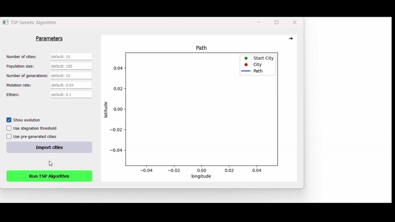
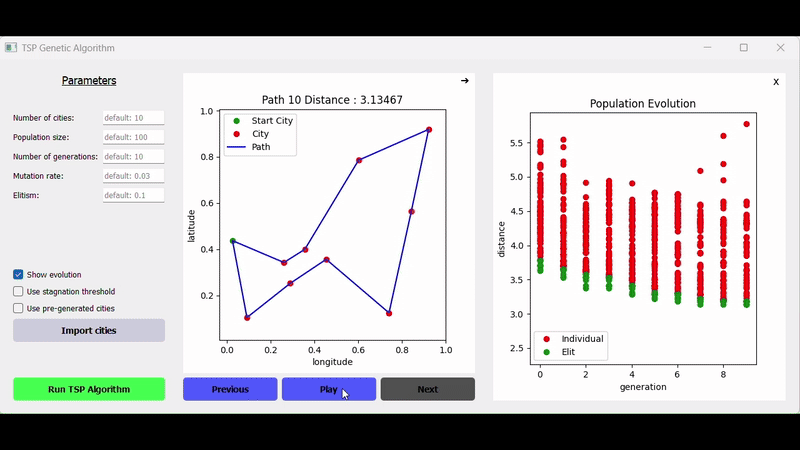

# Travelling Salesman Problem Solution

A solution to the travelling salesman problem (TSP) using a genetic algorithm. This provides a GUI to execute it and visualize the results.

## Table of contents

- [Key Features](#key-features)
- [Installation](#installation)
- [Usage](#usage)
- [License](#license)
- [Acknowledgments](#acknowledgments)

## Key Features

- **Genetic Algorithm**: Implements a genetic algorithm to find near-optimal solutions to the TSP.
- **Dynamic Visualization**: Real-time visualization of the algorithm's progress and results.
- **Customizable Parameters**: Allows users to set various parameters such as population size, number of generations, mutation rate, and elitism rate
- **Interactive GUI**: User-friendly GUI for easy interaction and visualization.
- **Path Retracing**: Ability to retrace the path step by step with buttons.

## Installation

To use the GUI, follow these steps:

1. Clone the repository:

   ```sh
       git clone https://github.com/ttmassa/travelling-salesman
       cd travelling-salesman
   ```

2. Install the required dependencies:
   ```sh
      pip install -r requirements.txt
   ```

## Usage

To run the application, execute the following command:

   ```sh
      python src/main.py
   ```
This will launch the GUI where you can input parameters and visualize the results. 

### Demo Videos

#### GUI Execution Demo


#### GUI Buttons Demo


## License

This project is licensed under the Apache-2.0 License. See the [LICENSE](LICENSE) file for more details.

## Acknowledgments

This project is part of a practical assignment for the Artificial Intelligence course at Université d'Évry Val d'Essonne - Paris Saclay. You can find the instructions [here](https://sites.google.com/site/bhanczarhomepage/teaching/l3-ia).
